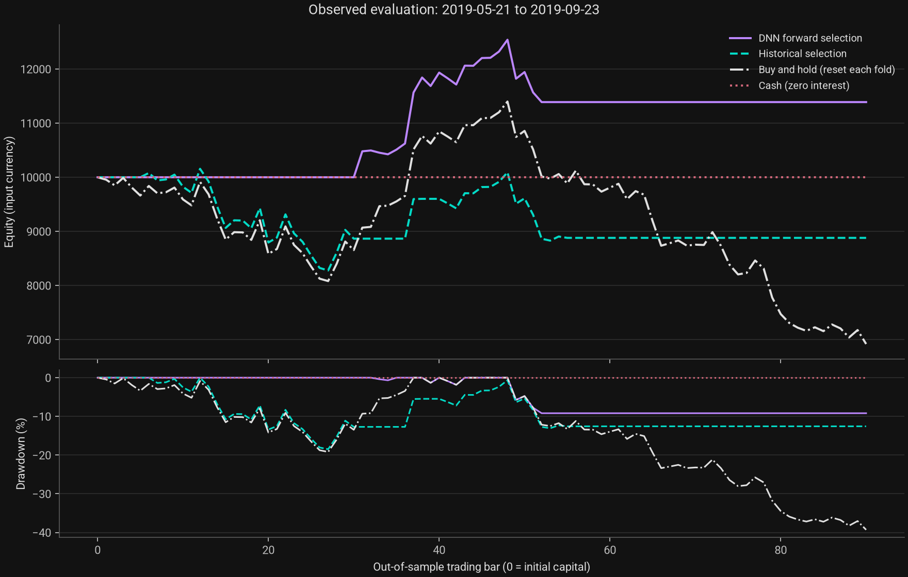

# DNN Forward Lab

**Choose a trading rule on a predicted future. Evaluate the decision on an observed one.**

[](https://github.com/nutdnuy/dnn-forward-lab/actions/workflows/ci.yml)


A reproducible Python research toolkit inspired by [Letteri et al. (2022), DNN-ForwardTesting](https://arxiv.org/abs/2210.11532). It trains four price networks, ranks a fixed universe of indicator strategies on recursive forecasts, and compares that decision with historical selection over the **same untouched test windows**.

**Research implementation, not an exact reproduction or a live trading system.** The included run uses synthetic prices. A favorable result in this fixture is not evidence of market profitability. Original code, weights and a verifiable data snapshot were unavailable; reconstruction choices are documented.

[คู่มือภาษาไทย](README.th.md) · [Methodology](docs/METHODOLOGY.md) · [Source map](docs/SOURCE_MAP.md) · [Data contract](docs/DATA.md) · [Validation evidence](docs/VALIDATION.md)



## Quick start

Python 3.11–3.13 and [uv](https://docs.astral.sh/uv/getting-started/installation/) are required for the locked workflow. Python 3.12 is recommended. The first installation downloads PyTorch; subsequent experiments run offline.

```bash
git clone https://github.com/nutdnuy/dnn-forward-lab.git
cd dnn-forward-lab
uv sync --frozen --python 3.12
uv run --frozen dnn-forward demo --output runs/first-demo
```

Open `runs/first-demo/report.html` in a browser. It bundles its fonts and charts without external requests. On macOS: `open runs/first-demo/report.html`. Choose a new output directory for each run; the experiment runner never overwrites existing artifacts.

Without uv, install from the repository with `python -m pip install .`, then run `dnn-forward demo --output runs/first-demo`. This uses compatible version ranges instead of the lockfile. This project is not published on PyPI. The uv configuration selects CPU-only PyTorch on Linux.

## What is included

| Layer | Behavior |
|---|---|
| Data | Strict daily single-asset OHLC validation; seeded synthetic fixture; explicit provenance |
| Forecasts | Four PyTorch networks, 5 → 50 → 25 → 1, ReLU, Adam, L1, recursive rollout |
| Selection | Twelve named indicators plus three combinations; fixed rules and deterministic ties |
| Evaluation | Expanding, disjoint walk-forward windows; chronological validation; train-only scaling |
| Execution | Previous-close signal, next-open fill, fractional shares, fees and slippage per side |
| Comparators | Historical selection, fold-reset buy-and-hold, cash; persistence/drift forecast baselines |
| Diagnostics | All OHLC errors, repaired candle counts, risk/return metrics, order/trade ledgers |
| Volatility | Parkinson, Garman–Klass, Rogers–Satchell, Yang–Zhang and cutoff-aware clustering |
| Reproducibility | Lockfile, config/data/source fingerprints, saved arrays, loss curves, CI |

Default dropout is **0.002**, a literal reading of the paper's **0.2%**, not silently treated as 20%. See the [methodology](docs/METHODOLOGY.md) for execution assumptions and paper ambiguities.

## Run with your own data

Supply consistently adjusted daily OHLC, one asset per file; volume is optional. Invalid candles, missing values and unsorted/duplicate dates fail validation. The package does not download data or infer adjustment conventions.

```bash
uv run --frozen dnn-forward validate data/ANF.csv
uv run --frozen dnn-forward run \
  --csv data/ANF.csv --asset ANF \
  --source "Your licensed provider; snapshot date YYYY-MM-DD" \
  --adjustment "Describe the same adjustment applied to all OHLC columns" \
  --config configs/research.toml \
  --output runs/anf-research
```

The research config needs **864 rows**: 504 initial historical bars plus 12 × 30 test bars. Extra trailing input rows are disclosed as unused. Run EOG or another asset separately with its own CSV and output directory.

For the optional **fixed ARIMA(1,1,1)** forecast baseline:

```bash
uv sync --frozen --extra statistics
uv run --frozen --extra statistics dnn-forward demo --arima --output runs/arima-demo
```

ARIMA non-convergence fails the run instead of quietly presenting unreliable output. This is not the paper's Auto-ARIMA search. Prophet is not implemented.

## Inspect every decision

```text
runs/first-demo/
  report.html                 Standalone report, assumptions and diagnostics
  manifest.json               Config, versions, data/source SHA-256, completion flag
  input.csv                   Exact normalized experiment input
  summary.json                Aggregate and per-fold metrics
  daily_returns.csv           Four methods over identical test dates
  performance.svg / .png      Charts from exported returns
  fold_01/
    selection.json            All 15 scores for both selection methods
    training.json             Fit/validation boundaries, scales, learning curves
    forecast.csv              Recursive path used for selection
    forecast_persistence.csv  Forecast baseline
    forecast_drift.csv        Forecast baseline
    result.json               Cutoff, choices, repairs and observed results
    *_daily.csv               Cash, shares, exposure, equity and returns
    *_orders.csv              Signal date, fill, commission, slippage and reason
    *_trades.csv              Complete net round trips
    weights/                  NPZ tensors, JSON metadata and observed context
```

The [checked-in example](examples/synthetic-run) uses a fixed seed and configuration for software verification. Do not optimize against it or present its returns as a market backtest. Git ignores `data/` and `runs/`; run directories inherit their input's sensitivity.

## Python API and model reuse

```python
from dnn_forward_lab.config import Config
from dnn_forward_lab.data import read_csv
from dnn_forward_lab.models import DNNForecaster

prices = read_csv("data/ANF.csv")
cutoff = 504
model = DNNForecaster(Config()).fit(prices.iloc[:cutoff])
# Only session dates are supplied, not future prices.
forecast = model.predict(prices.index[cutoff : cutoff + 30])
model.save("runs/anf-model")
restored = DNNForecaster.load("runs/anf-model")
```

For a genuinely unseen future, supply an explicit `DatetimeIndex` of exchange session dates strictly after the cutoff. The library does not invent exchange holidays. Loading uses JSON/CSV/NPZ with `allow_pickle=False`; no pickle checkpoint loading is exposed. See [examples/research_api.py](examples/research_api.py) for an offline end-to-end API example.

## Cluster historical volatility

```bash
uv run --frozen dnn-forward cluster \
  --asset ANF=data/ANF.csv --asset EOG=data/EOG.csv --asset IBM=data/IBM.csv \
  --cutoff 2021-10-15 --clusters 2 --output runs/volatility-clusters.json
```

This summarizes common **pre-cutoff** observations per asset and clusters four standardized features. It is an extension, not the paper's observation-level clustering, and does not automatically choose assets from future evaluation data.

## Verification

```bash
uv sync --frozen --all-extras
uv run --frozen ruff check .
uv run --frozen ruff format --check .
uv run --frozen --all-extras pytest --cov=dnn_forward_lab --cov-fail-under=85
uv build
```

Tests cover hand-calculated costs, starting-capital drawdown, flat-market indicators, analytical volatility formulas, future-mutation invariants, scaler boundaries, recursive consistency, saved-model round trips, escaped report text and real CLI execution. GitHub Actions checks Python 3.11, 3.12 and 3.13. See [CONTRIBUTING.md](CONTRIBUTING.md) for environment constraints and contribution rules.

## Research limits

- The paper's returns are **not** claimed as reproduced. The source map identifies differences and unavailable artifacts.
- Recursive point forecasts can be badly wrong. Geometry repair counts are visible because they affect selection. There is no calibrated uncertainty model.
- A fixed strategy universe can still suffer selection bias. Further parameter/universe searches require nested historical validation.
- Every fold resets and liquidates the portfolio, including the buy-and-hold comparator.
- Ratios assume zero risk-free return and 252 bars/year; short-window annualization is unstable. No significance claim is made.
- No broker connection, live orders, portfolio allocation, or real-market performance certification is included.

## Attribution and license

Original software: [MIT](LICENSE). Bundled Roboto fonts: SIL Open Font License, notices in `src/dnn_forward_lab/assets/`. The software license does not relicense the paper or third-party datasets.

```bibtex
@misc{letteri2022dnnforwardtesting,
  title={DNN-ForwardTesting: A New Trading Strategy Validation using
         Statistical Timeseries Analysis and Deep Neural Networks},
  author={Letteri, Ivan and Della Penna, Giuseppe and
          De Gasperis, Giovanni and Dyoub, Abeer},
  year={2022},
  eprint={2210.11532},
  archivePrefix={arXiv},
  primaryClass={q-fin.TR}
}
```
